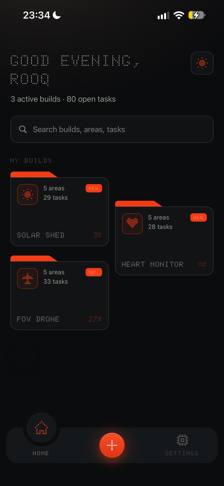
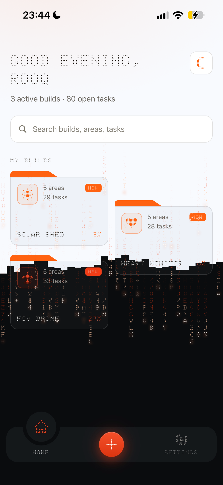
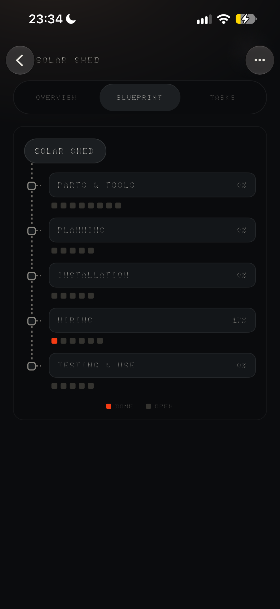
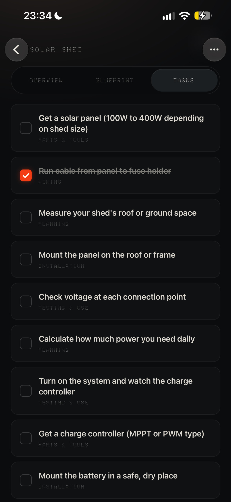
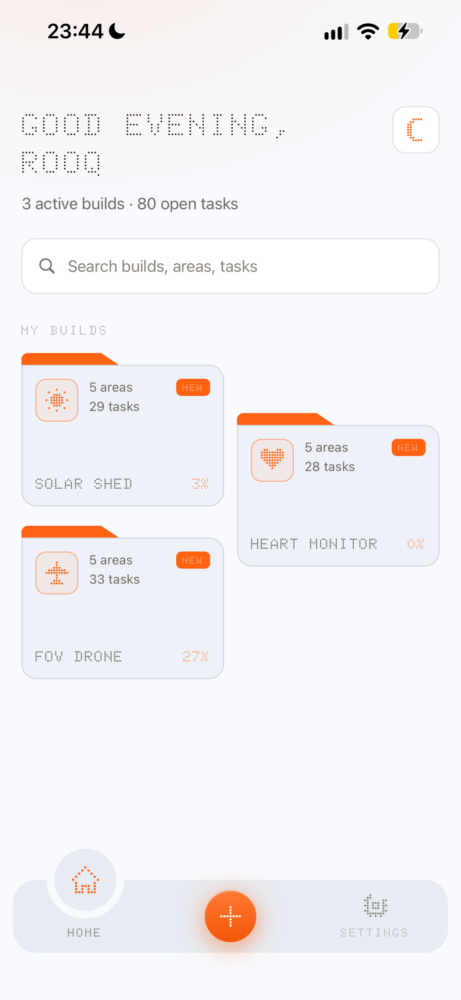

# FORGE

**Mission control for the things you build.**

FORGE is a mobile app for makers: people building robots, drones, synths, CNC machines, solar rigs, anything with parts and steps. You name a build, and FORGE breaks it into **areas** (Hardware, Power, Software…) and **tasks**, then shows the whole thing as a living blueprint that fills in as you work.

Built with Expo and React Native, Supabase and RevenueCat for **RevenueCat Shipaton 2026** (Next Gen).

<p>
  
  
  
  
  
</p>

---

## Why it exists

Hardware projects don't fail in one dramatic moment. They stall. You stop for a week, come back, and can't remember where you were, what you'd ordered, or what was next. General to-do apps don't help, because a build isn't a flat list: it's a set of connected parts moving at different speeds.

FORGE is designed around that one problem: **getting you back to work fast.**

- Open the app and **NEXT UP** tells you the one thing you pinned for your most recent build.
- Each build is a folder on a shelf, with its progress on the front.
- Open a build and the **blueprint** shows every area at a glance: what's done, what's stuck, what's untouched.

## What it does

**Plan**
- **AI plan.** Type a build's name and goal, and FORGE drafts areas and tasks specific to *that* build. Nothing is saved until you accept it.
- **Parts you already have.** List what's on your bench, and the plan is built around it and leaves it off the parts list.
- **What can I build?** Give FORGE a list of parts and it suggests four builds you could make with them.
- **Suggest tasks** for any single area when you're stuck on what comes next.
- **Starter areas** or **your own templates** when you'd rather not use AI.

**Track**
- **Blueprint view.** The build at the top, a spine running down, each area hanging off it with one square per task (lit = done). It assembles itself with a staggered animation when it opens.
- **Pinned next step.** One line per build (e.g. "Repeat the servo stall test on leg 3"), shown on Home as **NEXT UP** with how long ago you set it.
- **Search** across every build, area and task from Home.
- **Build icons.** Eight dot-matrix icons. While you type the name, FORGE picks one for you ("FPV drone" gets the plane) until you choose your own.
- Tick tasks off, swipe to delete **with undo**, rename anything, and archive builds you've paused.

**Share**
- **Share your blueprint** as an image or a text outline, made for #buildinpublic posts.

## FORGE Pro (RevenueCat)

Free accounts get **3 builds**. **FORGE Pro** (monthly or annual) unlocks unlimited builds, templates and blueprint sharing.

How RevenueCat is used:
- **Offerings and packages** come from RevenueCat, so prices and plans can change without an app update.
- **The `pro` entitlement** is the single source of truth. Settings re-reads it every time it opens, so a purchase or restore shows up immediately.
- **The paywall appears at the moment of highest intent:** after you've typed a real name and goal for a 4th build. It carries your half-finished build with it, so buying Pro **finishes creating that build** instead of making you type it again.
- **Honest trials.** On iPhone, FORGE asks RevenueCat whether you're still eligible for the free trial before promising one.
- **Restore purchases** is on the paywall.

## Design

The whole app is one design system (`src/theme.ts`): a near-black background with a warm glow from the top-left that shifts with the time of day, one orange accent (`#F43C14`), and two typefaces:
- **Doto**, a dot-matrix face, for headings, labels and numbers.
- **Quicksand** for anything you read word by word.

Every screen has designed **loading**, **error** and **empty** states, and all motion uses Material 3 easing curves (`src/lib/motion.ts`). Key actions (ticking a task, creating a build, a failed save) each have their own haptic, and tappable things squeeze slightly under your thumb.

**Light and dark.** Light mode is a full second palette, not an inverted screen. Switching is a "matrix rain" (`src/lib/appearance.tsx`): the screen is cut into columns one character wide, streams of dot-matrix characters step down cell by cell at different speeds, and the new theme appears above a ragged, moving edge. The choice is remembered on the phone.

On iPhone, FORGE uses the platform's own touches where it counts: San Francisco for body text, SF Symbols for icons, and Liquid Glass on menus and toasts.

## How the backend works

FORGE talks straight to Supabase from the app. There is no custom server, so security lives **in the database**:

- **Row Level Security** is on for every table. The database itself only returns rows that belong to the signed-in user, even if someone crafts requests by hand with the app's public key. Areas and tasks have no user column, so their rules check ownership *through* the build they belong to.
- **Progress is computed, never stored.** The `project_overview` and `area_progress` views count tasks on every read, so a percentage can never drift out of date.
- **Triggers keep the data honest:** they give new rows their position, copy a task's build from its area, stamp `updated_at`, and stamp when a next step was set. The app never sends those values, so it can never send them wrong.
- **Creating a build is one transaction** (`create_project` / `create_project_from_structure`). The build, its areas and its tasks are made all at once or not at all.
- **AI runs in a Supabase Edge Function** (`supabase/functions/ai`) that calls Claude. The API key lives only on the server. Each person gets 15 AI actions a day and the whole app has a daily cap, both enforced in the database (`sql/04_ai_limits.sql`). Builds meant to harm or spy on people are refused.

## Tech

| | |
|---|---|
| App | Expo SDK 57, React Native 0.86, Expo Router, TypeScript |
| Motion & graphics | Reanimated 4 (CSS-style animations), react-native-svg |
| Backend | Supabase: Postgres, Auth, Row Level Security, Edge Functions |
| AI | Claude (Anthropic) via a Supabase Edge Function |
| Payments | RevenueCat (`react-native-purchases`) |

```
src/
  app/          screens (Expo Router: one file per screen)
  components/   blueprint, bottom nav, sheets, icons, icon picker…
  lib/          database calls (projects.ts), auth, AI, Pro, motion
  theme.ts      every colour, font and spacing value in the app
sql/            database migrations, run in order (01 → 07)
supabase/       the AI Edge Function
```

## Run it yourself

You need a current LTS version of Node, a free [Supabase](https://supabase.com) project and an [Expo](https://expo.dev) account.

1. **Database.** In Supabase → SQL Editor, run each file in `sql/` **in order**, `01` to `07`. Only ever run `01_schema.sql` on a new project: it rebuilds the tables from scratch.
2. **AI function.** Deploy `supabase/functions/ai` and add the secret `ANTHROPIC_API_KEY` under Edge Functions → Secrets.
3. **Keys.** Copy `.env.example` to `.env` and fill in your Supabase URL and publishable key. The RevenueCat keys are optional: without them the app uses RevenueCat's Test Store.
4. **Run.** FORGE runs in **Expo Go** (RevenueCat switches to its Test Store there):
   ```bash
   npm install
   npx expo start --go
   ```
   Scan the QR code with Expo Go. Voice input ("say it out loud", `src/components/voice.tsx`) is built but switched off in this version: it needs a development build (`npx eas-cli build --profile development`), because Expo Go doesn't include speech recognition.

## Licence

FORGE's code is released under the **GNU Affero General Public License v3.0**. See [`LICENSE`](LICENSE). You're free to read it, learn from it, run it and change it. If you distribute it or run a modified version as a service, you must share your source under the same licence.

The fonts keep their own licences: Doto and Quicksand under the SIL Open Font License, MatrixType under CC0 (files in `assets/fonts/`).

© 2026 Rooq Prime
